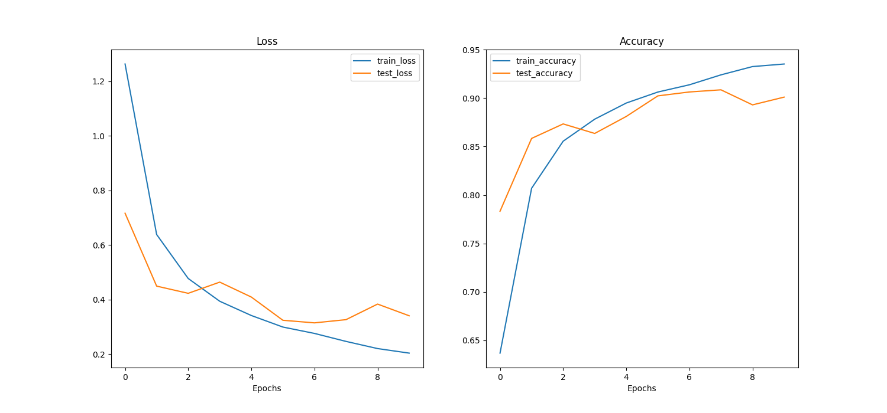
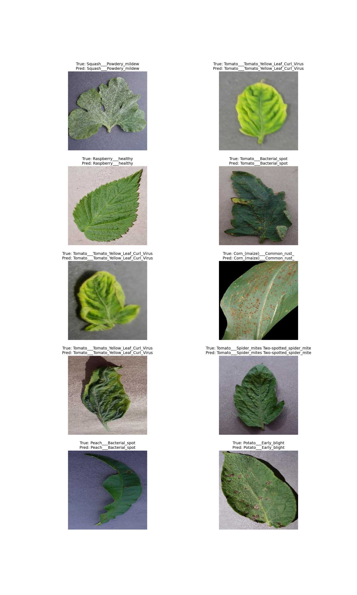

# 🌿 Plant Classification using CNN

This project focuses on **plant disease classification** using deep learning. A Convolutional Neural Network (CNN) is trained to classify plant leaf images into different disease categories.

---

## 📂 Dataset

This project uses the **PlantVillage Dataset**, which contains labeled images of healthy and diseased plant leaves.

🔗 Dataset Repository:
👉 [https://github.com/spMohanty/PlantVillage-Dataset](https://github.com/spMohanty/PlantVillage-Dataset)

---

## 🧠 Model

We use a **Convolutional Neural Network (CNN)** to extract spatial features from images and perform classification.

### Key Features:

* Multiple convolutional layers
* ReLU activation
* MaxPooling for downsampling
* Fully connected classifier for prediction

---

## 🔄 Data Preprocessing & Augmentation

To improve generalization and reduce overfitting, we applied the following augmentations:

```python
transforms.RandomHorizontalFlip(),
transforms.RandomRotation(20),
transforms.ColorJitter(),
```

### Why these augmentations?

* **RandomHorizontalFlip** → helps the model learn orientation-invariant features
* **RandomRotation(20)** → makes the model robust to rotated leaves
* **ColorJitter** → simulates lighting and color variations

---

## 📊 Data Splitting

The dataset is split into **training and testing sets** using **stratified sampling**:

* Ensures each class is represented proportionally
* Handles class imbalance effectively

---

## 🚀 How to Run

### 🔹 Train the model

```bash
python train_model.py
```

---

### 🔹 Test the model

```bash
python main.py
```

---

## 📈 Results

The trained model achieved the following performance on the test set:

```
Test Accuracy: 0.90
Test Precision: 0.90
Test Recall: 0.90
Test F1 Score: 0.90
```

---

## 📉 Training Curves

Below are the training and validation curves:

### 🔹 Loss & Accuracy Curve



---

## 🖼️ Sample Predictions

Below are some example predictions from the test dataset:



---

## 📌 Project Structure

```bash
plant_project/
│
├── train_model.py              # Training script
├── main.py                     # Testing / inference script
├── build_model.py              # CNN model definition
├── prepare_data/               # prepare train ,test data
├── images/                     # Plots & sample outputs
└── README.md
```

---

## ⚡ Summary

* Used **PlantVillage dataset** for plant disease classification
* Applied **data augmentation** to improve generalization
* Used **CNN model** for feature extraction and classification
* Achieved **~90% accuracy** on test data


